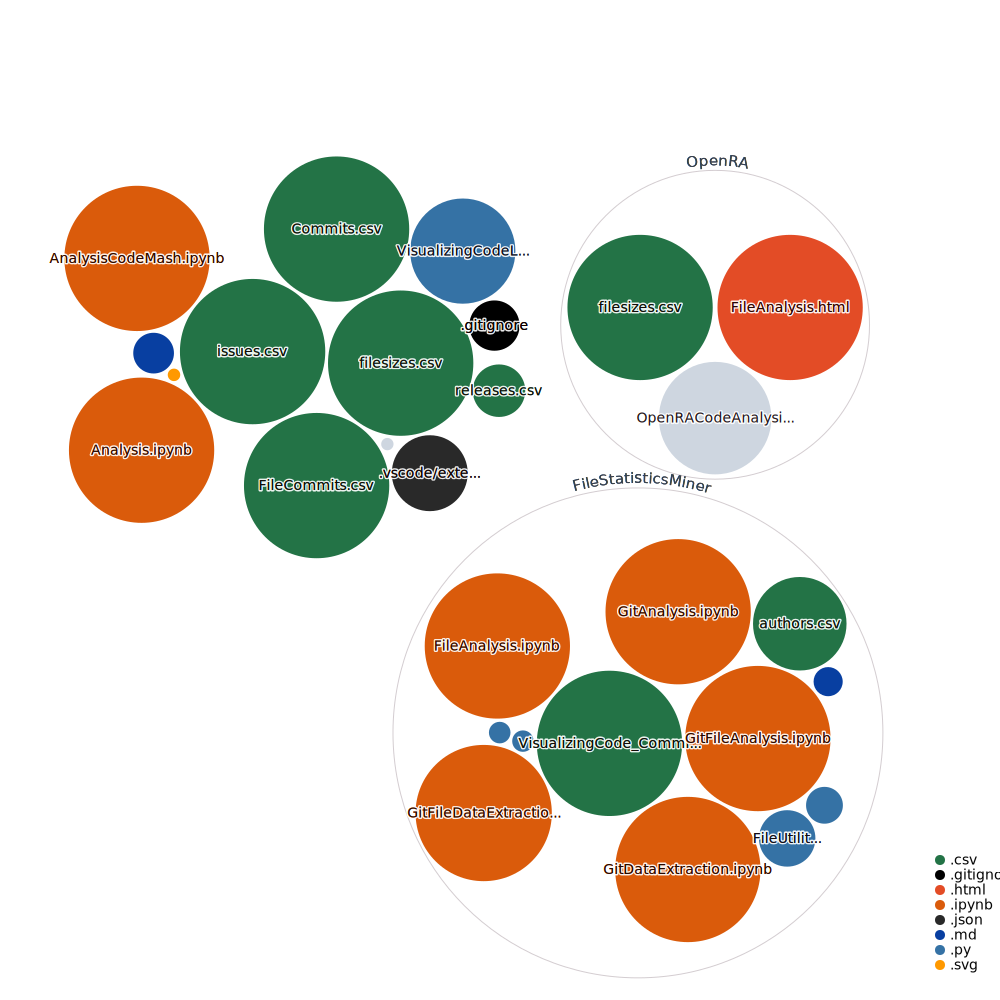

# VisualizingCode
Analysis resources for my [Visualizing Code](https://www.codemash.org/session-details/?id=281598) talk

[View interactive Diagram](https://octo-repo-visualization.vercel.app/?repo=integerman%2FVisualizingCode)

# Tasks

## File Analysis

- [ ] Get a true nested tree hierarchy going on TreeView
- [x] Clean up the labels & visuals on the box plot
- [x] Sort the box plot by median
- [x] Clean up the histogram
- [x] Export data to a CSV that can be used in other areas
- [ ] Investigate nested circles types of diagrams

## Git Commit Analysis

- [ ] Pull data from the local git repository for exploration
- [ ] Pull data from GitHub for exploration

## GitHub Issue Analysis

- [ ] Pull data from the local git repository for exploration
- [ ] Pull data from GitHub for exploration

## GitHub Octo

- [x] Add create-diagram.yml
- [x] Incorporate diagram into readme
- [x] Link to dedicated diagram page from readme